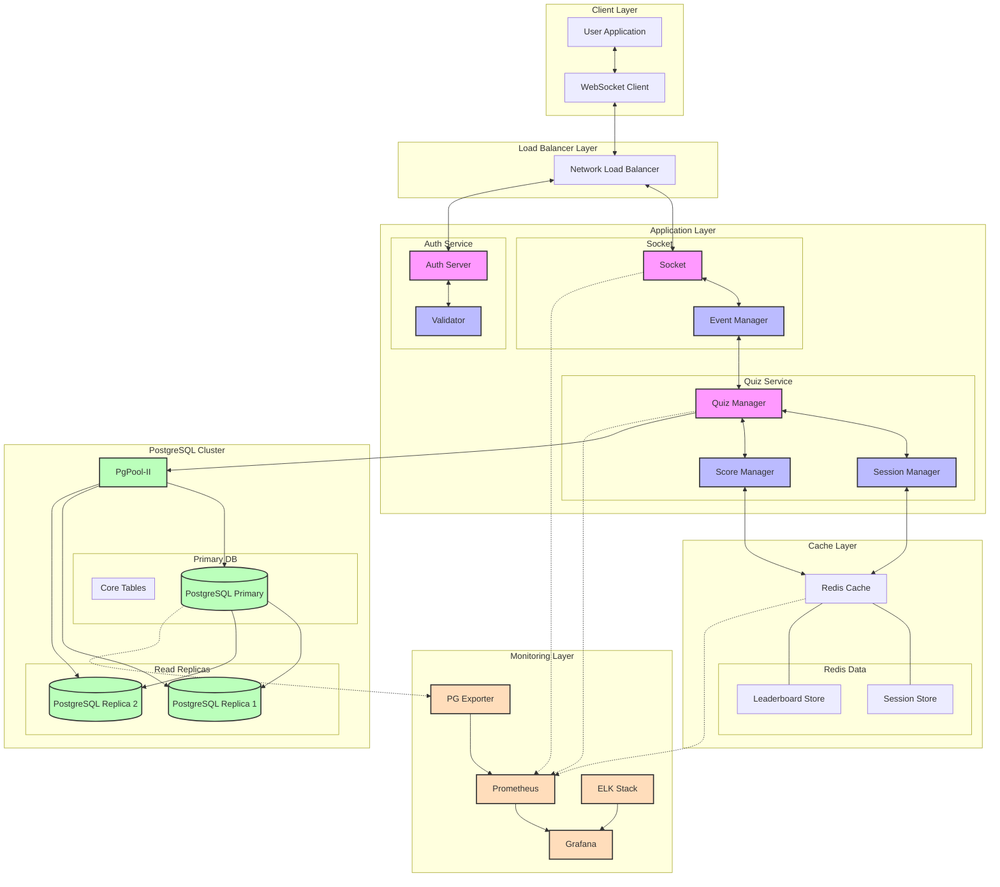

# Real-time Quiz Application

A scalable real-time quiz application that supports multiple concurrent quiz sessions with live leaderboard updates.

## Getting Started

1. Prerequisites:
   - Node.js (v16+)
   - Docker (for Redis)

2. Install dependencies:
```bash
npm install
```

2. Start development infrastructure:
```bash
npm run dev:infra:down && npm run dev:infra:up
```

3. Start development servers:
```bash
npm run dev
```

4. Run tests:
```bash
npm test
```

## Development Credentials

Admin account:
- Username: admin
- Password: Admin@123
- Email: admin@example.com

Test user accounts:
- Username: user1
- Password: User1@123
- Email: user1@example.com

- Username: user2
- Password: User2@123
- Email: user2@example.com


## Data Flow

### 1. Quiz Creation
```typescript
// When an admin creates a quiz
router.post('/', async (req, res) => {
    const { title, description, questions } = await createQuizSchema.parseAsync(req.body);
    
    const quiz = new Quiz();
    quiz.title = title;
    quiz.description = description;
    quiz.questions = questions;
    quiz.code = Math.random().toString(36).substring(2, 8).toUpperCase();
    quiz.isActive = true;

    await AppDataSource.getRepository(Quiz).save(quiz);
});
```

### 2. Quiz Participation
```typescript
// When a user joins a quiz
export class QuizWebSocketServer {
    private async handleJoin(ws: Client, data: any) {
        const { quizCode, userId } = data;
        
        // Add client to quiz room
        if (!this.quizRooms.has(quizCode)) {
            this.quizRooms.set(quizCode, new Set());
        }
        this.quizRooms.get(quizCode)?.add(ws);
        
        // Store quiz and user info in WebSocket client
        ws.quizId = quizCode;
        ws.userId = userId;
        
        // Broadcast updated participant list
        this.broadcastParticipants(quizCode);
    }
}
```

### 3. Answer Processing
```typescript
// When a user submits an answer
private async handleAnswer(ws: Client, data: any) {
    const { questionIndex, answer } = data;
    
    if (!ws.quizId || !ws.userId) return;

    const participation = await participationRepo.findOne({
        where: {
            quiz: { id: ws.quizId },
            user: { id: ws.userId }
        }
    });

    // Update score and answers
    const isCorrect = participation.quiz.questions[questionIndex].correctAnswer === answer;
    participation.score += isCorrect ? 10 : 0;
    participation.answers.push({ questionIndex, answer, isCorrect });
    
    await participationRepo.save(participation);
}
```

### 4. Leaderboard Updates
```typescript
// Broadcasting leaderboard updates
private async broadcastLeaderboard(quizId: number) {
    const leaderboard = await participationRepo.find({
        where: { quiz: { id: quizId } },
        relations: ['user'],
        order: { score: 'DESC' }
    });

    const leaderboardData = leaderboard.map(p => ({
        username: p.user.username,
        score: p.score
    }));

    const room = this.quizRooms.get(quizId);
    room?.forEach(client => {
        client.send(JSON.stringify({
            type: 'leaderboard',
            data: leaderboardData
        }));
    });
}
```


## Component Description

### Client Layer
- **User Application**: React-based frontend that handles quiz participation and admin functions
- **WebSocket Client**: Manages real-time communication with the server for live updates

### Gateway - Load Balancer Layer
- **Network Load Balancer**: Distributes traffic across multiple application instances for scalability

### Application Layer

#### Quiz Service & Socket
- **Quiz Manager**: Handles quiz creation, management, and state
- **Session Manager**: Manages user sessions and authentication state
- **Score Manager**: Processes answers and updates scores
- **WebSocket Server**: Manages real-time connections and event broadcasting
- **Event Manager**: Coordinates quiz events and updates across connected clients

#### Auth Service
- **Auth Server**: Handles user authentication and authorization

### Cache Layer
- **Redis Cache**:
  - Session Store: Maintains user session data
  - Leaderboard Store: Caches real-time leaderboard data

### Database Layer
- **PostgreSQL Cluster**:
  - Primary DB: Handles write operations
  - Read Replicas: Distributes read operations
  - PgPool-II: Manages connection pooling and load balancing


## Technologies and Tools

### Backend
- **Node.js & Express**: Fast, non-blocking I/O for handling concurrent connections
- **WebSocket**: Real-time bidirectional communication
- **TypeORM**: Type-safe database operations with TypeScript support
- **Redis**: High-performance caching and session management

### Frontend
- **React**: Component-based UI development
- **TypeScript**: Type safety and better developer experience
- **TailwindCSS**: Utility-first CSS framework for rapid UI development

### Database
- **SQLite** (Development): Simple, file-based database for development
- **PostgreSQL** (Production): Robust, scalable database for production use

### Testing
- **Jest**: Unit and integration testing
- **React Testing Library**: Component testing with user-centric approach

## System Architecture



